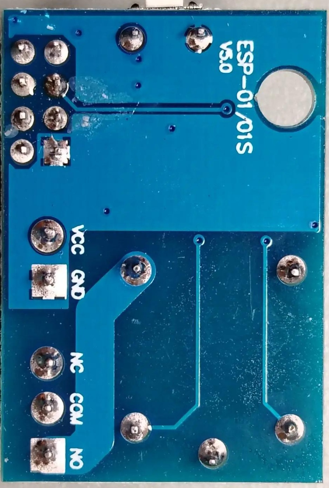

# ESP Reboot Switch

Умное реле для перезагрузки оборудования по питанию со встроенным веб-интерфейсом на базе ESP8266 и ESPHome.

## 🎯 Основная задача

**ESP Reboot Switch** — это умное устройство для **перезагрузки оборудования по питанию**. 

Основной сценарий использования: когда сервер, роутер, модем или другое сетевое устройство "зависает" и перестает отвечать, это устройство кратковременно обесточивает его, принудительно перезагружая.

**Устройство устанавливается в разрыв линии питания** между розеткой (или блоком питания) и нагрузкой. Реле физически разрывает или замыкает цепь питания, управляя подачей напряжения на подключенное оборудование.

## 📦 Используемое оборудование

Проект разработан и протестирован на **Wi-Fi реле с ESP8266 ESP-01S** — готовом модуле, который объединяет микроконтроллер ESP8266 с встроенным Wi-Fi и реле SPDT (10A/250V AC).

**Преимущества модуля:**
- Компактный размер
- Низкая стоимость (~$3-5)
- Простота подключения (не нужно паять отдельно реле и ESP)
- Легко прошивается через ESPHome

**Контакты на плате:**
- **VCC, GND** — питание модуля 5V
- **NC** — нормально замкнутый контакт реле
- **COM** — общий контакт реле
- **NO** — нормально разомкнутый контакт реле

## ⚡ Питание устройства

**Устройство питается от источника 5V DC** (постоянный ток). Это стандартное напряжение USB, что делает питание простым и доступным.

### Варианты питания:

1. **USB блок питания** (рекомендуется)
   - Любой USB зарядник на 5V/1A (как от телефона)
   - Подключается через micro-USB разъем на модуле ESP-01S
   - Самый простой и безопасный вариант

2. **DC-DC преобразователь**
   - Если нужно питать от 12V или 24V (например, от блока питания роутера)
   - Понижает напряжение до 5V
   - Позволяет использовать один источник питания для нескольких устройств

3. **Отдельный блок питания 5V**
   - Специализированный блок питания на 5V/2A
   - Надежный вариант для стационарной установки

### Важные моменты:

- **Потребление тока:** ESP-01S потребляет ~70mA в активном режиме, реле ~70mA при включении. Итого ~140mA максимум.
- **Рекомендуемый блок питания:** 5V/1A (1000mA) — с запасом для стабильной работы.
- **Не питайте от 3.3V!** ESP-01S требует 5V на вход (встроенный стабилизатор понижает до 3.3V для чипа).
- **Качество питания важно:** Используйте качественный блок питания с низким уровнем пульсаций для стабильной работы Wi-Fi.

## 🔧 Первая прошивка через FT232RL

Для первой прошивки устройства необходим **USB-TTL адаптер FT232RL** (или аналогичный на чипе CH340, CP2102).

### Необходимое оборудование:
- USB-TTL адаптер FT232RL
- Провода "мама-мама" или "мама-папа"
- Компьютер с установленным ESPHome

### Схема подключения ESP-01S к FT232RL:

| FT232RL | ESP-01S | Примечание |
|---------|---------|------------|
| **3.3V** | VCC (pin 8) | ⚠️ Только 3.3V, не 5V! |
| **GND** | GND (pin 1) | Общий провод |
| **TX** | RX (pin 4) | Cross connection |
| **RX** | TX (pin 8) | Cross connection |
| **GND** | GPIO0 (pin 3) | **Для режима прошивки!** |
| **3.3V** | CH_PD/EN (pin 7) | Включить чип |

### Процесс прошивки:

1. **Подключите ESP-01S к FT232RL** согласно таблице выше
2. **Важно:** GPIO0 должен быть подключен к GND — это переводит ESP в режим прошивки
3. **CH_PD (EN)** должен быть подключен к 3.3V — это включает чип
4. Подключите FT232RL к компьютеру через USB
5. Откройте ESPHome и создайте новый проект
6. Загрузите файл `esp-reboot-switch.yaml`
7. Нажмите **Install** → **Manual download** → скачайте прошивку
8. В ESPHome нажмите **Connect** и выберите COM-порт FT232RL
9. Загрузите прошивку в устройство
10. После прошивки **отключите GPIO0 от GND** (иначе устройство не загрузится)
11. Перезагрузите устройство

### Принципиальная схема модуля:

Схема показывает внутреннюю структуру модуля: ESP-01S управляет реле через оптрон PC817 и транзистор, что обеспечивает гальваническую развязку между управляющей цепью (3.3V) и силовой цепью реле.

## 🌐 Два режима работы

### Автономный режим
Работает как самостоятельное устройство в Wi-Fi сети. Управление через встроенный веб-интерфейс (порт 8080) с любого браузера (ПК, телефон, планшет). **Не требует Home Assistant** или других систем умного дома.

### Интеграция с Home Assistant
Полная интеграция через ESPHome API с шифрованием. Управление через dashboard HA, автоматизации, голосовые ассистенты (Алиса, Google Assistant).

## 🚀 Возможные применения

1. **Перезагрузка сетевых устройств:** Роутеры, модемы, IP-камеры, NAS при зависании.
2. **Перезагрузка серверов:** Домашние серверы (Home Assistant, Plex), игровые серверы.
3. **Автоматизация в умном доме:** Циклическое включение/выключение оборудования, защита от перегрева (включение вентилятора после выключения основного устройства).
4. **Импульсное питание:** Кратковременное включение для сброса счетчиков или тестирования устройств.
5. **Удаленное управление:** Перезагрузка оборудования на даче или в офисе через VPN и Home Assistant.

## ️ Ключевые возможности

### Управление питанием
- **Реле SPDT (NC/NO):** В основном режиме катушка реле обесточена — NC замкнут, питание подается на нагрузку. При перезагрузке реле кратковременно включается, размыкая NC и обесточивая нагрузку.
- **Настраиваемый таймер:** Время отключения от 1 до 600 секунд.
- **Выбор поведения при подаче питания:** Всегда включено / всегда выключено / восстановить последнее состояние.
- **Индикация состояния реле:** Показывает, какой контакт замкнут (NC или NO) в реальном времени.

### Безопасность
- **Веб-интерфейс защищен паролем** с возможностью смены через веб или HA.
- **Шифрование API** при работе с Home Assistant (протокол Noise).
- **Отключаемый веб-интерфейс:** Можно полностью заблокировать доступ через браузер, оставив только управление через HA. При этом управляемое оборудование не перезагружается.
- **Аварийный сброс физическими кнопками:**
  - **5 нажатий RST:** сброс пароля к `admin`.
  - **7 нажатий RST:** полный сброс (пароль + Wi-Fi + принудительное включение веб-интерфейса).

### Мониторинг
- **IP-адрес устройства** в реальном времени.
- **Уровень WiFi сигнала** и время работы (uptime).
- **Статус изменения пароля** с синхронизацией между веб-интерфейсом и HA.

## 🛠 Технические характеристики

- **Микроконтроллер:** ESP8266 (ESP-01S)
- **Реле:** SPDT, 10A/250V AC
- **Питание устройства:** 5V DC (USB или внешний блок питания)
- **Потребляемый ток:** ~140mA максимум
- **Wi-Fi:** 802.11 b/g/n
- **Веб-интерфейс:** порт 8080
- **Платформа прошивки:** ESPHome

## 📂 Структура файлов

- `esp-reboot-switch.yaml` — основной файл конфигурации ESPHome.
- `password_manager.h` — кастомный C++ код для управления паролем, веб-сервером и сбросом настроек.

##  Установка и подключение

### Подключение к сети питания

**Устройство устанавливается в разрыв линии питания:**

[Розетка 220V] ---- [COM реле] ---- [NC реле] ---- [Нагрузка (сервер/роутер)]
|
[ESP-01S управляет катушкой реле]
[Блок питания 5V] ---- [ESP-01S (питание модуля)]

### Схема подключения:

1. **Линия питания нагрузки (220V):**
   - **COM** (общий контакт реле) — подключите к фазе от источника питания (розетки или блока питания нагрузки).
   - **NC** (нормально замкнутый) — подключите к фазе нагрузки (сервера, роутера и т.д.).
   - В основном режиме (реле обесточено) цепь замкнута через NC, питание подается на нагрузку.
   - При перезагрузке реле включается, размыкая NC и обесточивая нагрузку на заданное время.

2. **Питание модуля ESP-01S (5V):**
   - Подключите блок питания 5V к micro-USB разъему на модуле ESP-01S.
   - Или используйте DC-DC преобразователь, если питаете от 12V/24V.
   - Убедитесь, что блок питания обеспечивает минимум 1A тока.

### Настройка после прошивки:

1. Подайте питание 5V на модуль ESP-01S.
2. Подключитесь к Wi-Fi сети `ESP-Reboot-Switch-AP` (пароль: `12345678`).
3. Откройте браузер и перейдите по адресу `192.168.4.1` (captive portal).
4. Введите данные вашей Wi-Fi сети.
5. Устройство перезагрузится и подключится к вашей сети.
6. Найдите IP-адрес устройства в роутере или через сканер сети.
7. Откройте веб-интерфейс: `http://[IP-адрес]:8080`
8. Настройте в Home Assistant (опционально).

## ⚠️ Важное предупреждение

Устройство работает с сетевым напряжением 220V (через реле). Если вы не уверены в своих навыках работы с электричеством — обратитесь к специалисту. Автор не несет ответственности за любой ущерб, причиненный в результате использования устройства.

---

*Проект создан и протестирован для интеграции с Home Assistant, но может работать полностью автономно.*

